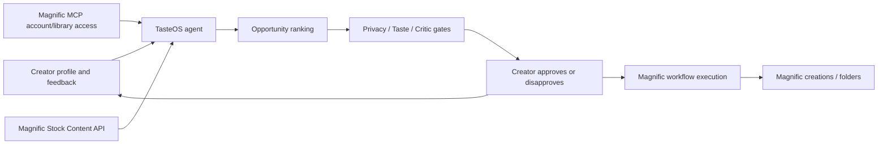

# Magnific Integration Notes

## Verified docs used

- Magnific Stock Content API supports searching, retrieving, and downloading images, templates, icons, videos, and music with an `x-magnific-api-key` header.
- Magnific text-to-image uses `POST https://api.magnific.com/v1/ai/text-to-image` with prompt, optional negative prompt, styling, image size, seed, `num_images`, and `filter_nsfw`.
- Magnific MCP is documented as a Model Context Protocol bridge for AI assistants and has a remote beta endpoint at `api.magnific.com/mcp` using a Magnific API key.

## Preferred real architecture

## API paths represented in the demo

| Need | Magnific path |
| --- | --- |
| Browse creator history | Magnific MCP/account-backed library access |
| Inspect spaces/folders | Magnific MCP/account-backed workspace access |
| Find stock assets | REST `GET /v1/resources`, `GET /v1/videos`, `GET /v1/music`, `GET /v1/icons` |
| Generate campaign stills | REST `POST /v1/ai/text-to-image` or Magnific MCP generation |
| Upscale or adapt assets | Magnific image editing/upscale workflow |
| Generate video | Magnific video generation workflow |
| Generate voice/audio | Magnific audio generation workflow |

## Why MCP matters here

The REST API is useful for productized backend calls. MCP is the better agent backbone because it can browse the user's Magnific creations and run tools with OAuth against the existing Magnific account. That matches the project concept: the agent should operate on the user's real library, not an exported dataset.
